# Diagrama de Arquitectura - NPLH Message Handler

## Visión General del Sistema

Este proyecto es un sistema multi-módulo para manejo de mensajes HL7 y Web Services en entornos hospitalarios.

## Diagrama Completo de Módulos y Clases

```mermaid
graph TB
    subgraph "MÓDULO: nplh-message-handler-controller"
        Main[Main<br/>SpringBootApplication]
        MC[MessageController<br/>REST API]
        HC[HostController<br/>REST API]
        UCR[UnifiedConvertRequest<br/>DTO]
        
        Main --> MC
        Main --> HC
        MC --> UCR
    end

    subgraph "MÓDULO: nplh-message-handler-generator"
        MS[MessageService<br/>Generación de Mensajes]
        MSG[Message<br/>Domain Model]
        MTI[MessageType<br/>Interface]
        MTR[MessageTypeResolver<br/>Factory]
        
        subgraph "Tipos de Mensaje - Enums"
            LIS_ENUM[LIS]
            VTG_ENUM[VTG]
            VTGWS_ENUM[VTGWS]
            VSS_ENUM[VSS]
            DP_ENUM[DP600]
            UPATH_ENUM[UPATHCLOUD]
            AUTO_ENUM[AUTOMATIONSW]
        end
        
        subgraph "Jerarquía HL7"
            HL7_BASE[HL7Segment<br/>Clase Base]
            HL7_MSG_INT[HL7Message<br/>Interface]
            
            subgraph "Segmentos Comunes HL7"
                MSH_COMMON[common.MSH<br/>Message Header]
                PID_COMMON[common.PID<br/>Patient ID]
                ORC_COMMON[common.ORC<br/>Order Common]
                OBR_COMMON[common.OBR<br/>Observation Request]
                OBX_COMMON[common.OBX<br/>Observation Result]
                PV1_COMMON[common.PV1<br/>Patient Visit]
                SAC_COMMON[common.SAC<br/>Specimen Container]
            end
            
            subgraph "Mensajes VTG"
                VTG_OML[VTG_OML21<br/>implements HL7Message]
                
                subgraph "Segmentos VTG_OML21"
                    MSH_VTG_OML[MSH_OML21]
                    PID_VTG_OML[PID_OML21]
                    PV1_VTG_OML[PV1_OML21]
                    ORC_VTG_OML[ORC_OML21]
                    OBR_VTG_OML[OBR_OML21]
                    OSegment[OSegment<br/>Container]
                end
                
                VTG_OML --> MSH_VTG_OML
                VTG_OML --> PID_VTG_OML
                VTG_OML --> PV1_VTG_OML
                VTG_OML --> OSegment
                OSegment --> ORC_VTG_OML
                OSegment --> OBR_VTG_OML
                
                MSH_VTG_OML -.hereda.-> MSH_COMMON
                PID_VTG_OML -.hereda.-> PID_COMMON
                PV1_VTG_OML -.hereda.-> PV1_COMMON
                ORC_VTG_OML -.hereda.-> ORC_COMMON
                OBR_VTG_OML -.hereda.-> OBR_COMMON
            end
            
            subgraph "Mensajes LIS"
                LIS_CASE[LIS_CASEUPDATE]
                LIS_OML[LIS_OML21<br/>implements HL7Message]
                LIS_SCAN[LIS_SCAN_SLIDE<br/>implements HL7Message]
                LIS_DEL_CASE[LIS_DELETE_CASE]
                LIS_DEL_SPEC[LIS_DELETE_SPECIMEN]
                LIS_DEL_SLIDE[LIS_DELETE_SLIDE]
                
                subgraph "Segmentos LIS_CASEUPDATE"
                    MSH_LIS_CASE[MSH]
                    PID_LIS_CASE[PID]
                    ORC_LIS_CASE[ORC]
                    OBR_LIS_CASE[OBR]
                end
                
                LIS_CASE --> MSH_LIS_CASE
                LIS_CASE --> PID_LIS_CASE
                LIS_CASE --> ORC_LIS_CASE
                LIS_CASE --> OBR_LIS_CASE
                
                MSH_LIS_CASE -.hereda.-> MSH_COMMON
                PID_LIS_CASE -.hereda.-> PID_COMMON
                ORC_LIS_CASE -.hereda.-> ORC_COMMON
                OBR_LIS_CASE -.hereda.-> OBR_COMMON
            end
            
            subgraph "Mensajes de Respuesta ACK"
                NPLH_ACK[NPLH_ACK<br/>implements HL7Message]
                LIS_ACK[LIS_ACK]
                VTG_ACK[ACK]
                
                subgraph "Segmentos ACK"
                    MSH_ACK[MSH]
                    MSA_ACK[MSA<br/>Message Acknowledgment]
                    ERR_ACK[ERR<br/>Error]
                end
                
                NPLH_ACK --> MSH_ACK
                NPLH_ACK --> MSA_ACK
                NPLH_ACK --> ERR_ACK
                
                MSH_ACK -.hereda.-> MSH_COMMON
                MSA_ACK --> HL7_BASE
                ERR_ACK --> HL7_BASE
            end
            
            %% Todos los segmentos heredan de HL7Segment
            MSH_COMMON --> HL7_BASE
            PID_COMMON --> HL7_BASE
            ORC_COMMON --> HL7_BASE
            OBR_COMMON --> HL7_BASE
            OBX_COMMON --> HL7_BASE
            PV1_COMMON --> HL7_BASE
            SAC_COMMON --> HL7_BASE
            
            %% Los mensajes implementan HL7Message
            VTG_OML -.implements.-> HL7_MSG_INT
            LIS_OML -.implements.-> HL7_MSG_INT
            LIS_SCAN -.implements.-> HL7_MSG_INT
            NPLH_ACK -.implements.-> HL7_MSG_INT
        end
        
        subgraph "Jerarquía WebService"
            WS_SEG[WSSegment<br/>Clase Base]
            WS_MSG_INT[WSMessage<br/>Interface]
            
            subgraph "Mensajes VTGWS"
                VTGWS_EVENT[VTGWS_ProcessVTGEvent]
                VTGWS_PAT[VTGWS_ProcessPatientUpdate]
                VTGWS_PHYS[VTGWS_ProcessPhysicianUpdate]
                
                VTGWS_EVENT --> WS_SEG
                VTGWS_PAT --> WS_SEG
                VTGWS_PHYS --> WS_SEG
            end
            
            subgraph "Mensajes VSS"
                VSS_STATUS[VSS_UpdateSlideStatus]
                VSS_SLIDE_INFO[SlideStatusInfo]
                
                VSS_STATUS --> WS_SEG
                VSS_STATUS --> VSS_SLIDE_INFO
                VSS_SLIDE_INFO --> WS_SEG
            end
            
            subgraph "Mensajes UPATHCLOUD"
                UPATH_SLIDE[UPATHCLOUD_SendScannedSlide<br/>implements WSMessage]
                UPATH_WSA[UPATHCLOUD_SendSlideWSAData]
                
                UPATH_SLIDE --> WS_SEG
                UPATH_WSA --> WS_SEG
                UPATH_SLIDE -.implements.-> WS_MSG_INT
            end
            
            subgraph "Mensajes DP600"
                DP_STATUS[DP600_SendUpdatedSlideStatus]
                
                DP_STATUS --> WS_SEG
            end
        end
        
        subgraph "Entidades Domain"
            PAT[Patient]
            SPEC[Specimen]
            BLOCK[Block]
            SLIDE[Slide]
            PROF_BASE[PersonInfo]
            PATH[Pathologist]
            PHYS[Physician]
            TECH[Technician]
        end
        
        MS --> MSG
        MS --> MTI
        MTR --> MTI
        
        LIS_ENUM -.implements.-> MTI
        VTG_ENUM -.implements.-> MTI
        VTGWS_ENUM -.implements.-> MTI
        VSS_ENUM -.implements.-> MTI
        DP_ENUM -.implements.-> MTI
        UPATH_ENUM -.implements.-> MTI
        AUTO_ENUM -.implements.-> MTI
        
        %% Los mensajes se generan desde Message
        VTG_OML -.generado desde.-> MSG
        LIS_CASE -.generado desde.-> MSG
        
        %% WSSegment también se relaciona con Message
        WS_SEG -.usa datos de.-> MSG
        
        MSG --> PAT
        MSG --> SPEC
        SPEC --> BLOCK
        BLOCK --> SLIDE
        
        PAT --> PROF_BASE
        PATH --> PROF_BASE
        PHYS --> PROF_BASE
        TECH --> PROF_BASE
    end

    subgraph "MÓDULO: nplh-message-handler-client-server"
        subgraph "Servidores"
            SRV_BASE[Server<br/>Base Class]
            HL7SRV[HL7Server<br/>TCP Listener]
            WSSRV[WSServer<br/>HTTP Handler]
            SRVS[Servers<br/>Manager]
            
            subgraph "Implementaciones Específicas"
                LIS_H[LISHandler]
                VTG_H[VTGHandler]
                VTGWS_H[VTGWSHandler]
                VSS_H[VSSHandler]
                DP_H[DPHandler]
                UPATH_H[UpathCloudHandler]
                SOAP_H[SoapHandler]
            end
            
            SRVS --> HL7SRV
            SRVS --> WSSRV
            HL7SRV --> SRV_BASE
            WSSRV --> SRV_BASE
            
            LIS_H --> HL7SRV
            VTG_H --> HL7SRV
            SOAP_H -.interface.-> WSSRV
            VTGWS_H --> SOAP_H
            VSS_H --> SOAP_H
            DP_H --> SOAP_H
            UPATH_H --> SOAP_H
        end
        
        subgraph "Clientes"
            CLI_BASE[Client<br/>Abstract]
            HL7CLI[HL7Client<br/>TCP Sender]
            WSCLI[WSClient<br/>HTTP Sender]
            RESTCLI[RestClient<br/>REST Sender]
            CLIS[Clients<br/>Manager]
            
            CLIS --> HL7CLI
            CLIS --> WSCLI
            CLIS --> RESTCLI
            HL7CLI --> CLI_BASE
            WSCLI --> CLI_BASE
            RESTCLI --> CLI_BASE
        end
        
        subgraph "Domain Models"
            SRVMSG[ServerMessage]
            CLIMSG[ClientMessage]
            CLIMSG_RESP[ClientMessageResponse]
            CLIMSG_LIST[ClientMessageList]
            
            subgraph "Response Models"
                RESP_INFO[ResponseInfo]
                RESP_STATUS[ResponseStatus]
                CUSTOM_RESP[CustomResponse]
            end
            
            subgraph "Host Models"
                HOST_INFO[HostInfo]
                HOST_LIST[HostInfoList]
                CONNECTION[Connection]
                HOST_TYPE[HostType<br/>Enum]
                CONN_TYPE[ConnectionType<br/>Enum]
                DIRECTION[Direction<br/>Enum]
            end
            
            SRV_BASE --> RESP_INFO
            SRV_BASE --> SRVMSG
            RESP_INFO --> RESP_STATUS
            RESP_STATUS --> CUSTOM_RESP
            
            CLIMSG_LIST --> CLIMSG
            CLIMSG --> CLIMSG_RESP
            
            HOST_LIST --> HOST_INFO
            HOST_INFO --> CONNECTION
            CONNECTION --> CONN_TYPE
            CONNECTION --> DIRECTION
            HOST_INFO --> HOST_TYPE
        end
        
        subgraph "Utilidades"
            MSG_HANDLER[MessageHandler]
            MSG_LOGGER[MessageLogger]
            SOAP_HANDLER[SoapMessageHandler]
            HL7_CHARS[HL7LLPCharacters<br/>Enum]
            MOCK_TYPE[MockType<br/>Enum]
        end
        
        subgraph "Services"
            UI_NOTIF[UINotificationService<br/>WebSocket]
        end
        
        HL7SRV --> MSG_HANDLER
        WSSRV --> SOAP_HANDLER
        HL7SRV --> MSG_LOGGER
        HL7CLI --> HL7_CHARS
        
        UI_NOTIF -.notifica.-> CLIMSG_LIST
    end

    subgraph "MÓDULO: nplh-message-handler-iris"
        IRIS_SRV[IrisService<br/>DB Integration]
        IRIS_CONN[IrisConnectionManager<br/>Connection Pool]
        STAIN_SRV[StainProtocolsService]
        
        IRIS_SRV --> IRIS_CONN
        STAIN_SRV --> IRIS_CONN
    end

    subgraph "MÓDULO: nplh-message-handler-tests"
        BASE_TEST[BaseTest<br/>Abstract]
        EXAMPLE_TEST[ExampleTest]
        MSG_SRV_TEST[MessageServiceTest]
        IRIS_INT_TEST[IrisServiceIntegrationTest]
        IRIS_REAL_TEST[IrisServiceRealTest]
        
        EXAMPLE_TEST --> BASE_TEST
        MSG_SRV_TEST --> BASE_TEST
        IRIS_INT_TEST --> BASE_TEST
        IRIS_REAL_TEST --> BASE_TEST
    end

    subgraph "MÓDULO: nplh-message-handler-ui (Frontend)"
        subgraph "React Components"
            APP[App.tsx]
            MSG_SIDEBAR[MessageSidebar]
            MSG_MODAL[MessageViewModal]
            SRV_SECTION[ServerSidebarSection]
        end
        
        subgraph "Services Frontend"
            MSG_SRV_FE[MessageService.ts]
            SRV_SRV_FE[ServerService.ts]
            SAVED_MSG_SRV[SavedMessagesService.ts]
        end
        
        subgraph "Config"
            MSG_CONFIG[messageConfig.ts]
        end
        
        APP --> MSG_SIDEBAR
        APP --> SRV_SECTION
        MSG_SIDEBAR --> MSG_MODAL
        MSG_SIDEBAR --> SAVED_MSG_SRV
        SRV_SECTION --> SRV_SRV_FE
        MSG_SRV_FE --> MSG_CONFIG
    end

    %% Relaciones entre módulos
    MC -.usa.-> MS
    MC -.usa.-> IRIS_SRV
    MC -.usa.-> CLIS
    MC -.usa.-> SRVS
    
    HC -.usa.-> IRIS_SRV
    HC -.usa.-> SRVS
    HC -.usa.-> HOST_LIST
    
    MSG_SRV_TEST -.prueba.-> MS
    IRIS_INT_TEST -.prueba.-> IRIS_SRV
    IRIS_REAL_TEST -.prueba.-> IRIS_SRV
    
    %% Frontend conecta con Backend
    MSG_SRV_FE -.HTTP API.-> MC
    SRV_SRV_FE -.HTTP API.-> HC
    SAVED_MSG_SRV -.HTTP API.-> MC
    
    %% IrisService es usado por múltiples componentes
    SRVS -.usa.-> IRIS_SRV
    
    classDef controller fill:#e1f5ff,stroke:#01579b,stroke-width:2px
    classDef service fill:#fff3e0,stroke:#e65100,stroke-width:2px
    classDef domain fill:#f3e5f5,stroke:#4a148c,stroke-width:2px
    classDef server fill:#e8f5e9,stroke:#1b5e20,stroke-width:2px
    classDef client fill:#fff9c4,stroke:#f57f17,stroke-width:2px
    classDef test fill:#fce4ec,stroke:#880e4f,stroke-width:2px
    classDef frontend fill:#e0f2f1,stroke:#004d40,stroke-width:2px
    
    class Main,MC,HC controller
    class MS,IRIS_SRV,STAIN_SRV,UI_NOTIF service
    class MSG,PAT,SPEC,BLOCK,SLIDE,SRVMSG,CLIMSG,HOST_INFO domain
    class SRV_BASE,HL7SRV,WSSRV,SRVS,LIS_H,VTG_H,VTGWS_H server
    class CLI_BASE,HL7CLI,WSCLI,CLIS client
    class BASE_TEST,EXAMPLE_TEST,MSG_SRV_TEST,IRIS_INT_TEST test
    class APP,MSG_SIDEBAR,MSG_SRV_FE,SRV_SRV_FE frontend
```



## Descripción de los Módulos

### 1. **nplh-message-handler-controller** (Capa de API)
- **Propósito**: Expone endpoints REST para el frontend
- **Clases Principales**:
  - `Main`: Punto de entrada Spring Boot
  - `MessageController`: API para generación/conversión/envío de mensajes
  - `HostController`: API para gestión de servidores y hosts
- **Responsabilidad**: Orquestar llamadas entre generator, iris y client-server

### 2. **nplh-message-handler-generator** (Generación de Mensajes)
- **Propósito**: Generar y convertir mensajes HL7 y WS según diferentes protocolos
- **Clases Principales**:
  - `MessageService`: Servicio principal de generación
  - `Message`: Modelo de dominio completo con Patient, Specimen, Block, Slide
  - `MessageType`: Interface implementada por enums (LIS, VTG, VTGWS, VSS, etc.)
  - `MessageTypeResolver`: Factory para resolver tipos de mensaje
- **Tipos de Mensajes**:
  - **HL7**: LIS, VTG
  - **WebService**: VTGWS, VSS, DP600, UPATHCLOUD, AUTOMATIONSW
- **Responsabilidad**: Lógica de negocio para transformación de mensajes

#### Jerarquía de Mensajes HL7

El módulo implementa una arquitectura de herencia para los segmentos HL7:

**Estructura Base:**
- `HL7Segment`: Clase base abstracta para todos los segmentos
- `HL7Message`: Interface que implementan los mensajes completos
- `@HL7Position`: Anotación para mapear campos a posiciones HL7

**Segmentos Comunes (package `common`):**
- `MSH` (Message Header): Cabecera del mensaje con tipo, fecha, control ID
- `PID` (Patient Identification): Información del paciente
- `ORC` (Order Common): Información común de la orden
- `OBR` (Observation Request): Solicitud de observación/examen
- `OBX` (Observation Result): Resultado de observación
- `PV1` (Patient Visit): Información de la visita del paciente
- `SAC` (Specimen Container): Información del contenedor de muestra

**Segmentos Específicos por Mensaje:**
Cada tipo de mensaje (VTG_OML21, LIS_CASEUPDATE, etc.) tiene sus propias clases de segmentos que **heredan** de los segmentos comunes y añaden personalización específica:

```java
// Ejemplo de herencia
package org.example.domain.hl7.VTG.VTGToNPLH.SPECIMENUPDATE;

public class MSH extends org.example.domain.hl7.common.MSH {
    // Personalización específica para VTG SpecimenUpdate
}
```

**Composición de Mensajes:**
- `VTG_OML21`: Contiene MSH_OML21 + PID_OML21 + PV1_OML21 + List<OSegment>
  - Cada OSegment contiene ORC_OML21 + OBR_OML21
- `LIS_CASEUPDATE`: Contiene MSH + PID + ORC + OBR
- `LIS_SCAN_SLIDE`: implements HL7Message
- `NPLH_ACK` (respuesta): Contiene MSH + MSA + ERR

Esta arquitectura permite:
- ✅ Reutilización de código común (campos estándar HL7)
- ✅ Personalización por tipo de mensaje
- ✅ Validación mediante anotaciones `@HL7Position`
- ✅ Conversión automática a formato HL7 (pipe-delimited)

#### Jerarquía de Mensajes WebService

Similar a HL7, pero usando XML en lugar de formato pipe-delimited:

**Estructura Base:**
- `WSSegment`: Clase base para todos los segmentos WS
- `WSMessage`: Interface para mensajes completos

**Implementaciones:**
- VTGWS: `ProcessVTGEvent`, `ProcessPatientUpdate`, `ProcessPhysicianUpdate`
- VSS: `UpdateSlideStatus` con `SlideStatusInfo`
- UPATHCLOUD: `SendScannedSlide`, `SendSlideWSAData`
- DP600: `SendUpdatedSlideStatus`

### 3. **nplh-message-handler-client-server** (Comunicaciones)
- **Propósito**: Gestionar servidores y clientes para recepción/envío de mensajes
- **Componentes**:

#### Servidores:
  - `Server`: Clase base con configuración de respuestas
  - `HL7Server`: Servidor TCP para mensajes HL7
  - `WSServer`: Servidor HTTP para Web Services
  - `Servers`: Manager que gestiona todos los servidores activos
  - **Handlers específicos**: LISHandler, VTGHandler, VTGWSHandler, VSSHandler, etc.

#### Clientes:
  - `Client`: Clase abstracta base
  - `HL7Client`: Cliente TCP para envío HL7
  - `WSClient`: Cliente HTTP para Web Services
  - `RestClient`: Cliente REST
  - `Clients`: Manager de clientes activos

#### Domain Models:
  - `ServerMessage`: Mensajes recibidos por servidores
  - `ClientMessage`: Mensajes enviados por clientes
  - `ClientMessageResponse`: Respuesta con timestamp
  - `HostInfo/HostInfoList`: Información de hosts y conexiones
  - `ResponseInfo/ResponseStatus`: Configuración de respuestas mock

#### Servicios:
  - `UINotificationService`: WebSocket para notificaciones en tiempo real al frontend

### 4. **nplh-message-handler-iris** (Integración BD)
- **Propósito**: Integración con base de datos InterSystems IRIS
- **Clases Principales**:
  - `IrisService`: Operaciones sobre IRIS (limpiar mensajes, obtener configuración)
  - `IrisConnectionManager`: Pool de conexiones JDBC
  - `StainProtocolsService`: Gestión de protocolos de tinción
- **Responsabilidad**: Persistencia y consultas a IRIS

### 5. **nplh-message-handler-tests** (Testing)
- **Propósito**: Tests de integración y unitarios
- **Clases Principales**:
  - `BaseTest`: Clase base abstracta con configuración común
  - `MessageServiceTest`: Tests del generador de mensajes
  - `IrisServiceIntegrationTest`: Tests de integración con IRIS
  - `IrisServiceRealTest`: Tests reales contra IRIS
- **Responsabilidad**: Validación de funcionalidad

### 6. **nplh-message-handler-ui** (Frontend React)
- **Propósito**: Interfaz web para gestión de mensajes y servidores
- **Componentes React**:
  - `App.tsx`: Componente principal
  - `MessageSidebar`: Gestión de mensajes guardados
  - `ServerSidebarSection`: Gestión de servidores
  - `MessageViewModal`: Visualización de mensajes
- **Servicios TypeScript**:
  - `MessageService.ts`: Llamadas API para mensajes
  - `ServerService.ts`: Llamadas API para servidores
  - `SavedMessagesService.ts`: Gestión local de mensajes guardados
- **Responsabilidad**: UI/UX y comunicación con API

## Flujo de Datos Principal

### 1. **Generación de Mensaje**
```
Frontend (MessageService.ts) 
  → MessageController.generateMessage()
  → MessageService.generateMessage()
  → Message.Default() 
  → Retorna Message con datos mock
```

### 2. **Conversión de Mensaje**
```
Frontend 
  → MessageController.convertMessage()
  → MessageService.convertMessage(message, messageType)
  → MessageType.convert() (LIS, VTG, VTGWS, etc.)
  → Retorna mensaje convertido (HL7 o XML)
```

### 3. **Envío de Mensaje**
```
Frontend 
  → MessageController.sendMessage()
  → Clients.getClient(hostName)
  → HL7Client/WSClient/RestClient.send()
  → Retorna ClientMessageResponse con timestamp
```

### 4. **Recepción de Mensaje en Servidor**
```
Cliente Externo 
  → HL7Server/WSServer (escuchando en puerto)
  → Handler específico (LISHandler, VTGHandler, etc.)
  → Procesa mensaje según configuración ResponseInfo
  → UINotificationService notifica al frontend via WebSocket
  → Frontend actualiza UI en tiempo real
```

### 5. **Gestión de Hosts desde IRIS**
```
Frontend 
  → HostController.getHosts()
  → IrisService.getHostInfo()
  → IrisConnectionManager.callString()
  → IRIS DB (Automation.HostController.GetHostsStatus)
  → Parsea JSON → HostInfoList
  → Retorna al frontend
```

### 6. **Arranque/Parada de Servidores**
```
Frontend 
  → HostController.toggleServer()
  → Servers.start()/stop()
  → HL7Server.run() o WSServer.createServer()
  → IrisService.enableTCPConnection() o enableWSConnection()
  → Servidor activo escuchando en puerto
```

## Patrones de Diseño Utilizados

1. **Factory Pattern**: `MessageTypeResolver` para crear tipos de mensaje
2. **Strategy Pattern**: `MessageType` interface con diferentes implementaciones
3. **Manager Pattern**: `Servers`, `Clients` para gestión centralizada
4. **Template Method**: `Server` clase base con métodos comunes
5. **Singleton**: Servicios Spring con `@Service`
6. **Observer Pattern**: `UINotificationService` con WebSocket
7. **DTO Pattern**: `UnifiedConvertRequest`, `ClientMessageResponse`

## Tecnologías por Módulo

| Módulo | Tecnologías |
|--------|-------------|
| controller | Spring Boot, REST, WebSocket |
| generator | Java 21, Jackson, Lombok |
| client-server | Java TCP/HTTP, Lombok, SLF4J |
| iris | JDBC, InterSystems IRIS |
| tests | JUnit 5, Mockito |
| ui | React, TypeScript, Vite, TailwindCSS |

## Dependencias entre Módulos

```
controller → generator (generación de mensajes)
controller → iris (consultas BD)
controller → client-server (envío/recepción)
tests → generator (testing)
tests → iris (testing)
ui → controller (API HTTP)
```

## Arquitectura General

El sistema sigue una arquitectura en capas:

1. **Presentación**: React UI (nplh-message-handler-ui)
2. **API**: Spring Boot Controllers (nplh-message-handler-controller)
3. **Lógica de Negocio**: MessageService (nplh-message-handler-generator)
4. **Comunicaciones**: Servers & Clients (nplh-message-handler-client-server)
5. **Datos**: IrisService (nplh-message-handler-iris)
6. **Testing**: JUnit Tests (nplh-message-handler-tests)

Esta arquitectura permite:
- ✅ Separación de responsabilidades
- ✅ Testabilidad independiente
- ✅ Escalabilidad por módulos
- ✅ Mantenibilidad del código

---

## Diagramas Detallados por Componente

### Diagrama de Jerarquía de Segmentos HL7

Este diagrama muestra cómo los segmentos HL7 específicos heredan de segmentos comunes:

```mermaid
graph TB
    subgraph "Base HL7"
        HL7_SEG[HL7Segment<br/>Clase Abstracta Base]
        HL7_MSG[HL7Message<br/>Interface]
        HL7_POS[@HL7Position<br/>Anotación]
    end
    
    subgraph "Segmentos Comunes (common package)"
        MSH_C[common.MSH<br/>Message Header<br/>Fields: sendingApp, receivingApp,<br/>messageType, controlID, etc.]
        PID_C[common.PID<br/>Patient Identification<br/>Fields: patientID, name,<br/>birthDate, gender, etc.]
        ORC_C[common.ORC<br/>Order Common<br/>Fields: orderControl,<br/>placerOrderNumber, etc.]
        OBR_C[common.OBR<br/>Observation Request<br/>Fields: specimenID,<br/>requestedTest, etc.]
        OBX_C[common.OBX<br/>Observation Result<br/>Fields: valueType,<br/>observationValue, etc.]
        PV1_C[common.PV1<br/>Patient Visit<br/>Fields: patientClass,<br/>attendingDoctor, etc.]
        SAC_C[common.SAC<br/>Specimen Container<br/>Fields: containerID,<br/>carrierType, etc.]
        
        MSH_C --> HL7_SEG
        PID_C --> HL7_SEG
        ORC_C --> HL7_SEG
        OBR_C --> HL7_SEG
        OBX_C --> HL7_SEG
        PV1_C --> HL7_SEG
        SAC_C --> HL7_SEG
    end
    
    subgraph "VTG Messages - NPLHToVTG"
        VTG_OML21[VTG_OML21<br/>Mensaje Completo OML^O21]
        
        MSH_OML21[MSH_OML21<br/>+ messageType: OML<br/>+ messageEvent: O21]
        PID_OML21[PID_OML21<br/>Datos específicos VTG]
        PV1_OML21[PV1_OML21<br/>Datos específicos VTG]
        ORC_OML21[ORC_OML21<br/>Datos específicos VTG]
        OBR_OML21[OBR_OML21<br/>Datos específicos VTG]
        OSEG[OSegment<br/>Contenedor ORC+OBR]
        
        VTG_OML21 -.implements.-> HL7_MSG
        VTG_OML21 --> MSH_OML21
        VTG_OML21 --> PID_OML21
        VTG_OML21 --> PV1_OML21
        VTG_OML21 --> OSEG
        OSEG --> ORC_OML21
        OSEG --> OBR_OML21
        
        MSH_OML21 -.extends.-> MSH_C
        PID_OML21 -.extends.-> PID_C
        PV1_OML21 -.extends.-> PV1_C
        ORC_OML21 -.extends.-> ORC_C
        OBR_OML21 -.extends.-> OBR_C
    end
    
    subgraph "VTG Messages - VTGToNPLH"
        VTG_SPEC_UPD[VTG_SpecimenUpdate<br/>Mensaje Actualización Specimen]
        VTG_SLIDE_UPD[VTG_SlideUpdate<br/>Mensaje Actualización Slide]
        VTG_BLOCK_UPD[VTG_BlockUpdate<br/>Mensaje Actualización Block]
        
        MSH_VTG_SPEC[MSH<br/>+ messageType: OUL<br/>+ messageEvent: R21]
        PID_VTG_SPEC[PID]
        OBR_VTG_SPEC[OBR]
        
        VTG_SPEC_UPD --> MSH_VTG_SPEC
        VTG_SPEC_UPD --> PID_VTG_SPEC
        VTG_SPEC_UPD --> OBR_VTG_SPEC
        
        MSH_VTG_SPEC -.extends.-> MSH_C
        PID_VTG_SPEC -.extends.-> PID_C
        OBR_VTG_SPEC -.extends.-> OBR_C
        
        VTG_SLIDE_UPD -.similar structure.-> VTG_SPEC_UPD
        VTG_BLOCK_UPD -.similar structure.-> VTG_SPEC_UPD
    end
    
    subgraph "LIS Messages - LISToNPLH"
        LIS_CASE[LIS_CASEUPDATE<br/>Actualización de Caso]
        LIS_OML[LIS_OML21<br/>Orden de Laboratorio]
        LIS_DEL_CASE[LIS_DELETE_CASE]
        LIS_DEL_SPEC[LIS_DELETE_SPECIMEN]
        LIS_DEL_SLIDE[LIS_DELETE_SLIDE]
        
        MSH_LIS_CASE[MSH<br/>+ messageType: OUL<br/>+ messageEvent: R21]
        PID_LIS_CASE[PID]
        ORC_LIS_CASE[ORC]
        OBR_LIS_CASE[OBR]
        
        LIS_CASE --> MSH_LIS_CASE
        LIS_CASE --> PID_LIS_CASE
        LIS_CASE --> ORC_LIS_CASE
        LIS_CASE --> OBR_LIS_CASE
        
        MSH_LIS_CASE -.extends.-> MSH_C
        PID_LIS_CASE -.extends.-> PID_C
        ORC_LIS_CASE -.extends.-> ORC_C
        OBR_LIS_CASE -.extends.-> OBR_C
        
        LIS_OML -.implements.-> HL7_MSG
        LIS_DEL_CASE -.similar structure.-> LIS_CASE
        LIS_DEL_SPEC -.similar structure.-> LIS_CASE
        LIS_DEL_SLIDE -.similar structure.-> LIS_CASE
    end
    
    subgraph "LIS Messages - NPLHToLIS"
        LIS_SCAN[LIS_SCAN_SLIDE<br/>Notificación de Escaneo]
        
        MSH_LIS_SCAN[MSH]
        PID_LIS_SCAN[PID]
        OBR_LIS_SCAN[OBR]
        SAC_LIS_SCAN[SAC]
        
        LIS_SCAN -.implements.-> HL7_MSG
        LIS_SCAN --> MSH_LIS_SCAN
        LIS_SCAN --> PID_LIS_SCAN
        LIS_SCAN --> OBR_LIS_SCAN
        LIS_SCAN --> SAC_LIS_SCAN
        
        MSH_LIS_SCAN -.extends.-> MSH_C
        PID_LIS_SCAN -.extends.-> PID_C
        OBR_LIS_SCAN -.extends.-> OBR_C
        SAC_LIS_SCAN -.extends.-> SAC_C
    end
    
    subgraph "ACK Messages (Respuestas)"
        NPLH_ACK[NPLH_ACK<br/>Respuesta NPLH]
        LIS_ACK[LIS_ACK<br/>Respuesta LIS]
        VTG_ACK[ACK<br/>Respuesta VTG]
        
        MSH_ACK[MSH<br/>+ messageType: ACK]
        MSA[MSA<br/>Message Acknowledgment<br/>Fields: ackCode, controlID]
        ERR[ERR<br/>Error Segment<br/>Fields: errorCode, errorText]
        
        NPLH_ACK -.implements.-> HL7_MSG
        NPLH_ACK --> MSH_ACK
        NPLH_ACK --> MSA
        NPLH_ACK --> ERR
        
        MSH_ACK -.extends.-> MSH_C
        MSA --> HL7_SEG
        ERR --> HL7_SEG
        
        LIS_ACK -.similar structure.-> NPLH_ACK
        VTG_ACK -.similar structure.-> NPLH_ACK
    end
    
    classDef baseClass fill:#ffeb3b,stroke:#f57f17,stroke-width:3px
    classDef commonClass fill:#81c784,stroke:#2e7d32,stroke-width:2px
    classDef vtgClass fill:#64b5f6,stroke:#1565c0,stroke-width:2px
    classDef lisClass fill:#ba68c8,stroke:#6a1b9a,stroke-width:2px
    classDef ackClass fill:#ff8a65,stroke:#d84315,stroke-width:2px
    
    class HL7_SEG,HL7_MSG,HL7_POS baseClass
    class MSH_C,PID_C,ORC_C,OBR_C,OBX_C,PV1_C,SAC_C commonClass
    class VTG_OML21,MSH_OML21,PID_OML21,VTG_SPEC_UPD,VTG_SLIDE_UPD vtgClass
    class LIS_CASE,LIS_OML,LIS_SCAN,MSH_LIS_CASE,LIS_DEL_CASE lisClass
    class NPLH_ACK,LIS_ACK,VTG_ACK,MSA,ERR ackClass
```

### Ejemplo de Mensaje HL7 Generado

Cuando `VTG_OML21` se convierte a string HL7:

```
MSH|^~\&|NPLH|Hospital XYZ|VTG|Lab|20231110120000||OML^O21|MSG123456|P|2.5
PID|||PAT001||Doe^John||19800115|M
PV1||I|Ward123^Bed1|||Dr.Smith^John
ORC|NW|ORD001|||CM
OBR||ORD001||85025^CBC^LN|||20231110120000
```

Cada línea es un segmento HL7, generado por el método `toString()` de cada clase de segmento.

### Diagrama de Jerarquía WebService

```mermaid
graph TB
    subgraph "Base WebService"
        WS_SEG[WSSegment<br/>Clase Base<br/>+ addIndentation()<br/>+ nullSafe()<br/>+ toXML()]
        WS_MSG[WSMessage<br/>Interface]
    end
    
    subgraph "VTGWS Messages"
        VTGWS_EVENT[VTGWS_ProcessVTGEvent<br/>Procesar Evento VTG]
        VTGWS_PAT[VTGWS_ProcessPatientUpdate<br/>Actualizar Paciente]
        VTGWS_PHYS[VTGWS_ProcessPhysicianUpdate<br/>Actualizar Médico]
        
        EVENT_STATUS[EventStatus<br/>Estado del Evento]
        
        VTGWS_EVENT --> WS_SEG
        VTGWS_PAT --> WS_SEG
        VTGWS_PHYS --> WS_SEG
        VTGWS_EVENT --> EVENT_STATUS
        EVENT_STATUS --> WS_SEG
    end
    
    subgraph "VSS Messages"
        VSS_UPDATE[VSS_UpdateSlideStatus<br/>Actualizar Estado Slide]
        VSS_INFO[SlideStatusInfo<br/>Información Estado]
        
        VSS_UPDATE --> WS_SEG
        VSS_UPDATE --> VSS_INFO
        VSS_INFO --> WS_SEG
    end
    
    subgraph "UPATHCLOUD Messages"
        UPATH_SCAN[UPATHCLOUD_SendScannedSlide<br/>Enviar Slide Escaneado]
        UPATH_WSA[UPATHCLOUD_SendSlideWSAData<br/>Datos WSA]
        
        UPATH_SCAN -.implements.-> WS_MSG
        UPATH_SCAN --> WS_SEG
        UPATH_WSA --> WS_SEG
    end
    
    subgraph "DP600 Messages"
        DP_STATUS[DP600_SendUpdatedSlideStatus<br/>Estado Actualizado]
        
        DP_STATUS --> WS_SEG
    end
    
    classDef baseWS fill:#fff3e0,stroke:#e65100,stroke-width:3px
    classDef vtgWS fill:#e1bee7,stroke:#6a1b9a,stroke-width:2px
    classDef vssWS fill:#c5cae9,stroke:#3949ab,stroke-width:2px
    classDef upathWS fill:#b2dfdb,stroke:#00695c,stroke-width:2px
    classDef dpWS fill:#ffccbc,stroke:#d84315,stroke-width:2px
    
    class WS_SEG,WS_MSG baseWS
    class VTGWS_EVENT,VTGWS_PAT,VTGWS_PHYS,EVENT_STATUS vtgWS
    class VSS_UPDATE,VSS_INFO vssWS
    class UPATH_SCAN,UPATH_WSA upathWS
    class DP_STATUS dpWS
```

### Ejemplo de Mensaje WebService Generado

Cuando `UPATHCLOUD_SendScannedSlide` se convierte a XML:

```xml
<soapenv:Envelope xmlns:soapenv="http://schemas.xmlsoap.org/soap/envelope/">
  <soapenv:Body>
    <SendScannedSlide>
      <slideNumber>SLIDE-001</slideNumber>
      <accessionNumber>ACC-12345</accessionNumber>
      <status>SCANNED</status>
      <scanDate>2023-11-10T12:00:00</scanDate>
    </SendScannedSlide>
  </soapenv:Body>
</soapenv:Envelope>
```

Cada clase WSSegment implementa su propio método `toXML()` que genera el XML específico.
